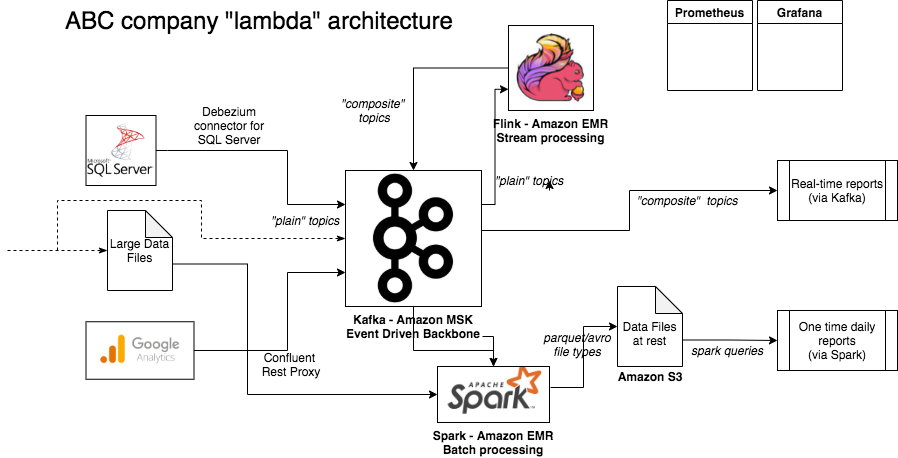

# Solution Design

### Prerequisites

1. Install [draw.io](https://download.draw.io/)

### Problem statement

See parent folder `README` file, `Solution design` section.

### Diagram

Editable `.png` file in `draw.io`.

### High-level description

The proposed solution design follows a [lambda](https://en.wikipedia.org/wiki/Lambda_architecture) data processing architecture pattern where data can be consumed in **streaming** fashion (for near-real-time use-cases) and **batching** fashion (for daily reports and other "heavier" operations).

We have **Apache Kafka** as the backbone, where it's performance, reliability, scalability, fault tolerance, (among others) can **collect/consume** events from various sources, transform them if necessary (**Kafka Streams** vs **Apache Flink** detail below) and **produce** new data points (events) to be displayed in dashboards/reports.

As we want a NRT (near real time) data flow, data should be provided to the reporting solution **already transformed**.

As an example, a new login entry collected from Google Analytics, would flow as an event to Kafka Streams (or Flink), event which combined with state would create a new event: the total number of logins for that user, and display that info in a dashboard/report.

My experience shows that **Kafka Streams** is directed to more simple transformations (use of KTable, operations, ...) and **Flink** is directed to more complex/convoluted operations (use of Flink state, tumbling windows, ...).

Now the **batching processing** section would be based on **Apache Spark**.

With **Spark streaming** collecting data from **Apache Kafka** and storing it as **Parquet/Avro** files (at rest) and **Spark (Core)** collecting data from big data files, saving them as **Parquet/Avro** files and being responsible as a processing engine to build complex reports on top of this data.

One remark on the dotted lines flowing to **Kafka**. To be able to use the data stored in the large data files in **streaming** fashion, we should explore how to get the data as **events** downstream and avoid a direct connection to Kafka.

For platform logging/monitoring/alerting, AWS managed **Prometheus** and **Grafana** can capture metrics from Kafka, Flink and Spark, providing the platform operators all the info needed to keep a stable process ongoing.

On the report tool choice, there are proprietary tools like **Tableau**, **MicroStrategy**, **Databricks** and open source tools like **Zeppelin**. The choice would depend mainly on price, scope (internal or client facing) and flexibility (read-only reports or interactive).

Finally to ensure data is **secure**, encryption at rest and other data cloud best practices on data security, auditing and compliance (GDPR) should be applied.

### Other references

1. [Debezium SQL Server Source Connector for Confluent Platform](https://docs.confluent.io/debezium-connect-sqlserver-source/current/overview.html)
1. [How Kafka met your Google Analytics data](https://blog.softwaremill.com/how-kafka-met-your-google-analytics-data-a5435c76769c)
